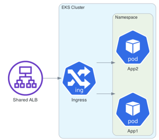

# Configuration of EKS + Fargate + Shared ALB
## Introduction
Managing multiple services on Amazon EKS can be challenging, especially when it comes to efficiently routing traffic. A shared Elastic Load Balancer (ELB) can simplify this process by acting as a single entry point for multiple services. In this guide, we’ll walk through setting up a shared ELB using the eks-shared-elb repository on GitHub.

## Prerequisites
Before you begin, ensure you have the following:

An AWS account with the necessary permissions.
An existing Amazon EKS cluster.
Basic knowledge of Kubernetes and AWS services.
## System Architecture Overview



## Step 1: Clone the Repository
Start by cloning the eks-shared-elb repository to your local machine:

```git clone https://github.com/helli0n/eks-shared-elb.git
cd eks-shared-elb
```

## Step 2: Configure AWS Infrastructure and Kubernetes
The repository includes Terraform scripts to set up the required AWS infrastructure. This includes VPCs, subnets, and security groups. Navigate to the terraform directory and apply the configurations:
```
cd terraform
terraform init
terraform apply
```

## Step 3: Configure Ingress Resources
The ingress resources route traffic from the ELB to the appropriate services within your EKS cluster. Ensure that the ingress configurations match your service requirements:

```
apiVersion: networking.k8s.io/v1
kind: Ingress
metadata:
name: eks-ingress
namespace: test-fargate
annotations:
kubernetes.io/ingress.class: alb
alb.ingress.kubernetes.io/certificate-arn: arn:aws:acm:region:account-id:certificate/cert-id
alb.ingress.kubernetes.io/healthcheck-port: traffic-port
alb.ingress.kubernetes.io/listen-ports: '[{"HTTP": 80}, {"HTTPS": 443}]'
alb.ingress.kubernetes.io/load-balancer-attributes: idle_timeout.timeout_seconds=600
alb.ingress.kubernetes.io/scheme: internet-facing
alb.ingress.kubernetes.io/ssl-redirect: "443"
alb.ingress.kubernetes.io/success-codes: "200"
alb.ingress.kubernetes.io/tags: Environment=env_name,Application=nginx-shared
alb.ingress.kubernetes.io/target-group-attributes: stickiness.enabled=true,stickiness.lb_cookie.duration_seconds=60
alb.ingress.kubernetes.io/target-type: ip
alb.ingress.kubernetes.io/group.name: shared
finalizers:
- ingress.k8s.aws/resources
  spec:
  ingressClassName: alb
  rules:
- host: eod.env.example.com
  http:
  paths:
    - path: /*
      pathType: Prefix
      backend:
      service:
      name: nginx
      port:
      number: 80
```

When you add the `alb.ingress.kubernetes.io/group.name: shared` annotation to your Ingress resources, the AWS Load Balancer Controller will group these Ingresses into a single ALB. This means that all traffic directed to this ALB will be routed according to the rules defined in the grouped Ingress resources.

## Step 4: Verify the Setup
After deploying the manifests, verify that the ELB is correctly routing traffic to your services. You can check the status of the ingress resources and the ELB in the AWS Management Console:

```kubectl get ingress```

## Conclusion
By following these steps, you can set up a shared ELB for multiple services on Amazon EKS, optimizing resource usage and simplifying traffic management. The eks-shared-elb repository provides a robust starting point for this setup, ensuring a scalable and efficient infrastructure.

## Useful Links
[eks-shared-elb GitHub Repository](https://github.com/helli0n/eks-shared-elb)
[AWS Elastic Beanstalk Shared ALB Documentation](https://docs.aws.amazon.com/elasticbeanstalk/latest/dg/environments-cfg-alb-shared.html)
[AWS EKS ALB Ingress Documentation](https://docs.aws.amazon.com/eks/latest/userguide/alb-ingress.html)
[AWS Blog on Ingress Sharing and Target Group Binding](https://aws.amazon.com/blogs/containers/a-deeper-look-at-ingress-sharing-and-target-group-binding-in-aws-load-balancer-controller/)